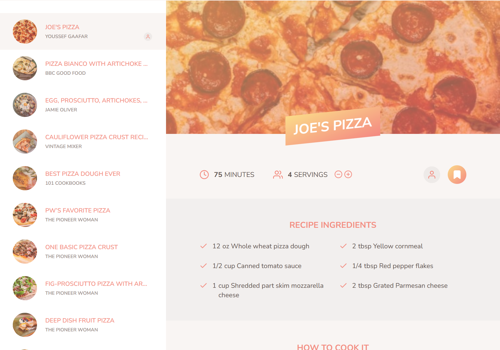

#  Forkify

**Forkify** is a state-of-the-art recipe searching and management web application. It offers an intuitive way for users to search, explore, bookmark, and upload recipes. Designed using the **MVC (Model-View-Controller) architecture**, Forkify focuses on scalability, maintainability, and performance. With over **1 million recipes** at your fingertips, Forkify transforms your cooking experience.

---

## 🧾 **Overview**

Forkify is built to handle all aspects of a modern web application:
- **Search:** Find recipes using a powerful search engine.
- **Dynamic Updates:** Recipes and lists are dynamically updated without page reloads.
- **State Management:** Robust handling of the application's state ensures smooth user experience.
- **Mobile-Responsive:** The UI is designed to work seamlessly across devices.

This project is an excellent demonstration of **JavaScript ES6+**, **async/await**, **API integration**, and **modular SCSS styling**.

---

## 🎯 **Features**

### Core Features:
1. **Search Functionality**
   - Users can search for recipes using keywords (e.g., "pasta", "chicken").
   - Fetches recipes from an online **Forkify API**.
   - Displays results in a **scrollable list** with pagination for large datasets.

2. **Detailed Recipe View**
   - Displays recipe details including preparation time, servings, and ingredients.
   - Calculates adjusted ingredient quantities based on user-defined servings.
   - Dynamically updates ingredient amounts as servings are modified.

3. **Custom Recipe Upload**
   - Users can upload their own recipes with a custom form.
   - Recipes are validated and added to the local storage for persistence.

4. **Bookmarking**
   - Bookmark your favorite recipes for quick access.
   - Bookmarks are saved in **localStorage**, allowing them to persist even after the app is closed.

5. **Pagination**
   - Users can navigate large datasets with previous and next buttons.

6. **Interactive UI**
   - Fully dynamic UI using **modern JavaScript DOM manipulation**.
   - Smooth transitions between states.

---

## 🧩 **Technical Deep Dive**

### **Architecture**
Forkify uses the **MVC architecture** to create a separation of concerns:
- **Model:** Manages application state, fetches data from APIs, and updates data locally.
- **View:** Handles DOM updates and user interactions. Each section of the UI (e.g., bookmarks, search results, recipe details) has its own view module.
- **Controller:** Acts as a bridge between the model and view, orchestrating their interactions.


---

## 👨🏻‍💻 **Code Structure**

* **src** (source):
    * **img** (images): Contains images and icons used by the application.
    * **js** (JavaScript): Contains JavaScript modules for your application.
        * **views** (views): Holds individual view components for the UI.
        * **config.js**: Stores configuration settings like API endpoints and constants.
        * **controller.js**: Manages the central application logic.
        * **helpers.js**: Provides utility functions for data fetching and manipulation.
        * **model.js**: Manages the application state (data).
    * **sass** (stylesheets): Contains SCSS for modular and responsive styling.
* **docs** (documentation): Contains documentation and diagrams related to the project.

---

## 🔑 **Key Files**

1. **`controller.js`:**
   - Main entry point for the application logic.
   - Listens to events from the UI and triggers updates in the model or view.

2. **`model.js`:**
   - Fetches recipe data from the API using async/await.
   - Handles state management (search results, bookmarks, servings).

3. **`helpers.js`:**
   - Contains reusable utility functions, such as making API requests.

4. **View Modules (`views/*.js`):**
   - Each view module manages a specific part of the UI (e.g., recipe details, search results, bookmarks).
   - Updates the DOM efficiently using JavaScript.

---

## 🔗 **API Integration**

Forkify uses a **public recipe API** to fetch data dynamically. The API endpoint is defined in `config.js`. Data fetching is done via modern `fetch` with error handling in place.

### Example API Call:
```javascript
const res = await fetch(`https://forkify-api.herokuapp.com/api/v2/recipes/${id}`);
const data = await res.json();
```

### Response Example
```json
{
  "recipe": {
    "title": "Spaghetti Bolognese",
    "publisher": "Chef John",
    "ingredients": [
      { "quantity": 200, "unit": "g", "description": "spaghetti" },
      { "quantity": 100, "unit": "g", "description": "minced beef" }
    ]
  }
}
```

---

## 📋 State Management

The application maintains several states:

1. **Search State:** Stores query results and current pagination state.
2. **Recipe State:** Stores the current recipe data (ingredients, servings).
3. **Bookmark State:** Stores a list of bookmarked recipes in **localStorage**, ensuring persistence across sessions.
---

## ✨ Highlights

1. **Responsive Design:** Built using SCSS for modular styling and seamless responsiveness.
2. **Dynamic Bookmarking:** Recipes persist between sessions using local storage.
3. **Custom Recipe Validation:** Ensures that user-uploaded recipes meet format requirements.

---

## 🚀 Getting Started

#### Requirements

- **Node.js** (v14+)
- **NPM** (v6+)

#### Setup

1. **Clone the repository:**
   ```bash
   git clone https://github.com/YoussefGaafar/forkify-webapp.git
   cd forkify-webapp
   ```
2. **Install dependencies:**
   ```bash
   npm install
   ```
3. **Start the development server:**
   ```bash
   npm start
   ```
4. **Access the app at: http://localhost:1234**

---

## 🏦 Production Build

To generate a production-ready build, use:
```bash
npm run build
```

---

## 🔍 Screenshots

#### Dashboard


#### Search Results


#### Recipe View


---

## 📜 Future Enhancements

1. **Offline Mode:** Allow users to access bookmarked recipes without an internet connection.
2. **Profile Management:** Enable users to create accounts and sync recipes/bookmarks across devices.
3. **Advanced Filters:** Add filters such as diet preferences, cuisine type, and preparation time.

---

### 🙏🏻 Acknowledgments
Special thanks to [Jonas Schmedtmann](https://twitter.com/jonasschmedtman) for his exceptional resources, tutorials, and guidance that inspired this project.

**Enjoy cooking and happy coding! 🍳✨**
